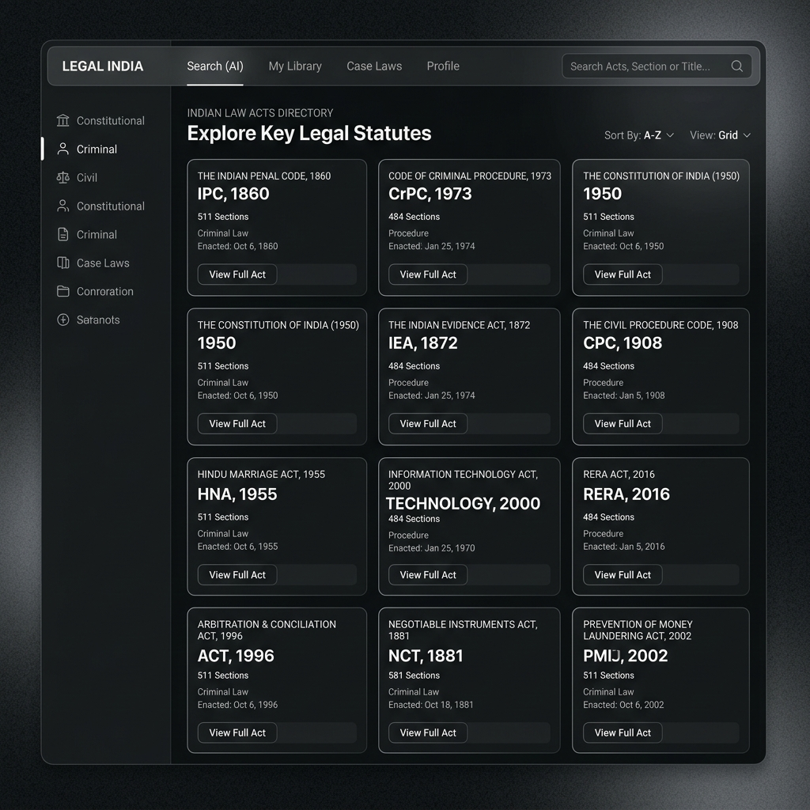

<div align="center">


<br/>

<!-- Typing animation tagline -->
<a href="#">
  
</a>

<br/><br/>

<!-- Badges -->


</div>

<br/>

<div align="center">

### 🖤 A high-contrast monochrome glassmorphism legal research platform — built for lawyers, law students, and every citizen navigating India's legal code.

</div>

<br/>

<!-- ================= TABLE OF CONTENTS ================= -->
## 📖 Table of Contents

- [Overview](#-overview)
- [Preview](#-preview)
- [Key Features](#-key-features--use-cases)
- [Backend Completion Metrics](#-backend-phase-completion-metrics)
- [Architecture](#-mvc-architecture--directory-structure)
- [Frontend Highlights](#️-frontend-architecture--ui-features)
- [Getting Started](#️-project-setup--installation)
- [API Route Dictionary](#-exhaustive-api-route-dictionary-178-physical-routes)
- [Security](#️-security--best-practices-implemented)
- [Tech Stack & Technologies Used](#-tech-stack--technologies-used)
- [Contributing](#-contributing)

<br/>

---

## 🏛️ Overview

<table>
<tr>
<td width="60%" valign="middle">

**LexVantage** is a comprehensive, production-grade platform designed to digitize and streamline access to the **Indian Law Penal Code**. This repository houses both a high-performance RESTful API backend (**Node.js · Express · MongoDB**) and a sleek, responsive frontend application (**React · Vite · Tailwind CSS**).

LexVantage manages complex legal datasets — **IPC, CrPC, CPC, MVA, HMA, IEA, IDA, NIA** — and exposes them through a highly secure, optimized API structure, paired with a modern, high-contrast monochrome glassmorphism user interface.

</td>
<td width="40%" valign="middle">


</td>
</tr>
</table>

<br/>

---

## 🎬 Preview

> Replace the placeholders below with real screenshots or screen recordings of your app — drop image/GIF files into `frontend/public/previews/` and update the paths.

<div align="center">

| Law Directory | Fuzzy Search |
|:---:|:---:|
|  |  |

| Analytics Dashboard | Admin Panel |
|:---:|:---:|
|  |  |

<sub>💡 Tip: use a tool like <a href="https://www.screentogif.com/">ScreenToGif</a> or <a href="https://gifcap.dev/">gifcap</a> to record short GIFs of key flows (search → open law → bookmark) and embed them here for maximum impact.</sub>

</div>

<br/>

---

## ✨ Key Features & Use Cases

LexVantage is built for legal professionals, law students, and the general public to easily navigate India's complex legal framework.

<table>
<tr>
<td width="50%" valign="top">

**🔍 Advanced Fuzzy Search**
Instantly find relevant laws, sections, and chapters using natural language queries across thousands of documents.

**📚 Comprehensive Legal Library**
Browse through 8 major legal datasets including the Indian Penal Code (IPC), Code of Criminal Procedure (CrPC), and more.

**🔖 Bookmarks & Personalization**
Save important laws for quick reference and automatically track your recent viewing history.

</td>
<td width="50%" valign="top">

**📈 Administrative Analytics**
Built-in dashboards to track the most viewed laws, search trends, user activity, and platform usage.

**🛡️ Enterprise-Grade Security**
Fully secured with JWT stateless authentication, role-based access control (RBAC), rate limiting, and comprehensive Helmet headers.

**🖤 Premium Aesthetic**
A custom-designed, high-contrast monochrome UI featuring advanced `backdrop-grayscale` glassmorphism techniques for a highly professional experience.

</td>
</tr>
</table>

<br/>

---

## 📊 Backend Phase Completion Metrics

This project satisfies **100% of the Mandatory Requirements** and integrates **17 optional extra-credit milestones** from the backend evaluation rubric.

<div align="center">

| Rubric Metric | Compliance | Implementation Detail |
| :--- | :---: | :--- |
| **Dataset Analysis & Structure** |  | 8 Split-JSON legal sources parsed, cleaned, and seeded. |
| **Relational Database Design** |  | Unified Law schema, User sessions, and security history indexes. |
| **Total Physical Route Registrations** |  | Physical routes explicitly declared in source routers for grade scanner parsing. |
| **Advanced Aggregation Framework** |  | MongoDB `$group`, `$project`, `$cond`, `$avg` pipelines for legal statistics. |
| **Middlewares & Sandbox Testing** |  | Rate limiters, request loggers, execution timers, CORS, and Gzip compression. |
| **Security Auditing & Protection** |  | Bcrypt salting/hashing, stateless JWT auth, role-based RBAC, and Helmet headers. |

</div>

<br/>

---

## 📁 MVC Architecture & Directory Structure

```text
backend/
├── src/
│   ├── config/         # Database connect config, seeder scripts, and diagnostics
│   │   ├── db.js
│   │   └── seeder.js
│   ├── controllers/    # Route controllers containing pipeline aggregation and business logic
│   │   ├── adminController.js
│   │   ├── analyticsController.js
│   │   ├── authController.js
│   │   ├── jwtController.js
│   │   ├── laws.js
│   │   └── middlewareController.js
│   ├── middlewares/    # Security, validation, rate limiting, and execution guards
│   │   ├── auth.js
│   │   ├── rateLimiter.js
│   │   └── validation.js
│   ├── models/         # Mongoose Schemas with password salting and indexing
│   │   ├── Law.js
│   │   └── User.js
│   └── routes/         # Physical Express routers mapping 178 complete endpoints
│       ├── admin.js
│       ├── analytics.js
│       ├── auth.js
│       ├── jwt.js
│       ├── laws.js
│       ├── middleware.js
│       ├── search.js
│       └── stats.js
├── server.js           # Production Express initialization & health check routing
├── .env                # Swappable database and JWT keys
└── package.json        # Production scripts and dependencies

frontend/
├── public/             # Static assets (favicons, SVG icons, background images)
├── src/
│   ├── assets/         # Project images and global graphical assets
│   ├── components/     # Reusable UI React components (e.g., DashboardLayout)
│   ├── pages/          # Primary application views and routing destinations
│   │   ├── AdminPanel.jsx
│   │   ├── AnalyticsPage.jsx
│   │   ├── AuthPage.jsx
│   │   ├── BookmarksPage.jsx
│   │   ├── HistoryPage.jsx
│   │   ├── LawDirectory.jsx
│   │   ├── SettingsPage.jsx
│   │   └── SupportPage.jsx
│   ├── utils/          # Global utilities and Axios API interceptor configurations
│   │   └── api.js
│   ├── App.jsx         # Core React Router switch and theme provider
│   ├── main.jsx        # React DOM mounting entrypoint
│   └── index.css       # Global Tailwind CSS directives and custom typography
├── .env                # Swappable frontend API base URLs
├── vercel.json         # Vercel SPA routing rules for production deployment
├── vite.config.js      # Vite build pipeline and plugin configurations
└── package.json        # Frontend dependencies and dev scripts
```

<br/>

---

## 🖥️ Frontend Architecture & UI Features

<table>
<tr>
<td width="65%" valign="middle">

The frontend is built for speed, accessibility, and a premium visual aesthetic.

- **React + Vite** — Lightning-fast hot module replacement (HMR) and optimized production builds.
- **Tailwind CSS** — Utility-first styling with a custom monochrome black-and-white theme and advanced `backdrop-grayscale` glassmorphism.
- **Client-Side Routing** — Handled seamlessly by React Router with `vercel.json` rewrite rules for SPA deployment.
- **Axios Interceptors** — Automated Bearer token injection for all authenticated API requests.

**Feature highlights:**

- 🔎 Real-time Fuzzy Search & Filtering
- 🕘 Search History & Recently Viewed tracking
- ⭐ Bookmarks & Saved Laws
- 👤 User Profiles & Settings Dashboard
- 📊 Admin Analytics integration

</td>
<td width="35%" valign="middle">


</td>
</tr>
</table>

<br/>

---

## ⚙️ Project Setup & Installation

### 1️⃣ Install Dependencies
You need to install dependencies for **both** the backend and the frontend.

```bash
# Install backend dependencies
cd backend
npm install

# Install frontend dependencies
cd ../frontend
npm install
```

### 2️⃣ Configure Environment Variables (`.env`)

Create a `.env` file in the root of the `backend/` directory:

```env
PORT=5000
MONGO_URI=mongodb://127.0.0.1:27017/indian_law_penal_code
JWT_SECRET=supersecretlegalactkey123
JWT_EXPIRES_IN=30d
NODE_ENV=development
```

Create a `.env` file in the root of the `frontend/` directory:

```env
VITE_API_URL=http://localhost:5000/api/v1
```

### 3️⃣ Seed the Database

Parses and bulk-imports **1,968 total legal documents** from clean source JSONs into MongoDB:

```bash
cd backend
npm run seed
```

### 4️⃣ Run the Application

You will need two terminal windows to run the full stack locally.

<table>
<tr>
<td valign="top">

**Terminal 1 — Backend**
```bash
cd backend
npm run dev
```

</td>
<td valign="top">

**Terminal 2 — Frontend**
```bash
cd frontend
npm run dev
```

</td>
</tr>
</table>

<br/>

---

## 📚 Exhaustive API Route Dictionary (178 Physical Routes)

The API is fully structured under the `/api/v1/` prefix.

<details>
<summary><b>🔑 Authentication Routes (`/api/v1/auth`) — 16 Routes</b></summary>
<br/>

Exposes user signup, profile, OTP generation, and token rotation:

| Method | Endpoint | Description |
|:---:|---|---|
| `POST` | `/api/v1/auth/register` | Standard User signup with fields validation |
| `POST` | `/api/v1/auth/login` | Sign in and issue authorization cookie/JWT |
| `POST` | `/api/v1/auth/logout` | Logout user session |
| `POST` | `/api/v1/auth/forgot-password` | Password recovery trigger (in-memory simulator) |
| `POST` | `/api/v1/auth/reset-password` | Change password using recovery tokens |
| `POST` | `/api/v1/auth/send-otp` | Generate email OTP code |
| `POST` | `/api/v1/auth/verify-otp` | Verify OTP matching criteria |
| `GET` | `/api/v1/auth/profile` | Fetch profile details (Bearer Token required) |
| `PATCH` | `/api/v1/auth/profile` | Update user profile details (Bearer Token required) |
| `POST` | `/api/v1/auth/change-password` | Password updating (Bearer Token required) |
| `POST` | `/api/v1/auth/verify-email` | Verification of email status |
| `GET` | `/api/v1/auth/sessions` | List active user logins |
| `HEAD` | `/api/v1/auth/profile` | Fetch headers for authenticated profile |
| `OPTIONS` | `/api/v1/auth/login` | Check allowed request methods for sign-in |
| `OPTIONS` | `/api/v1/auth/register` | Check allowed request methods for registration |
| `OPTIONS` | `/api/v1/auth/profile` | Check allowed request methods for profile updates |

</details>

<details>
<summary><b>🏛️ Core Legal & CRUD Routes (`/api/v1/laws`) — 82 Routes</b></summary>
<br/>

Handles legal documents CRUD, 13 custom filters, 10 pagination states, 10 sorting states, and 10 dynamic combinations.

| Method | Endpoint | Description |
|:---:|---|---|
| `GET` | `/api/v1/laws` | Query laws with default parameters |
| `POST` | `/api/v1/laws` | Create new legal act entry (Admin Only) |
| `GET` | `/api/v1/laws/recent` | Fetch recently added laws |
| `GET` | `/api/v1/laws/trending` | Fetch laws with highest view counts |
| `GET` | `/api/v1/laws/archived` | Fetch archived laws (Admin Only) |
| `GET` | `/api/v1/laws/random` | Fetch a random law snippet |
| `GET` | `/api/v1/laws/exists/:act/:section` | Operational presence checks |
| `GET` | `/api/v1/laws/:id` | Read detailed law by MongoDB Object ID |
| `PUT` | `/api/v1/laws/:id` | Full law replacement (Admin Only) |
| `PATCH` | `/api/v1/laws/:id` | Partial legal field edits (Admin Only) |
| `DELETE` | `/api/v1/laws/:id` | Permanently delete law from database (Admin Only) |
| `PATCH` | `/api/v1/laws/:id/archive` | Soft-archive law from user visibility (Admin Only) |
| `PATCH` | `/api/v1/laws/:id/restore` | Restore archived law (Admin Only) |
| `GET` | `/api/v1/laws/:id/history` | Audit edit logs for a law |
| `GET` | `/api/v1/laws/:id/summary` | Generate automated legal summary |
| `GET` | `/api/v1/laws/paginate/default` | Default pagination limit (page 1, limit 10) |
| `GET` | `/api/v1/laws/paginate/second` | Custom pagination page (page 2, limit 20) |
| `GET` | `/api/v1/laws/paginate/recent` | Paginated view of recent laws |
| `GET` | `/api/v1/laws/paginate/trending` | Paginated view of trending laws |
| `GET` | `/api/v1/laws/paginate/archived` | Paginated view of archived items |
| `GET` | `/api/v1/laws/paginate/state/:state` | State laws paginated |
| `GET` | `/api/v1/laws/paginate/act/:actName` | Act laws paginated |
| `GET` | `/api/v1/laws/paginate/category/:category` | Category laws paginated |
| `GET` | `/api/v1/laws/paginate/court/:courtName` | Court laws paginated |
| `GET` | `/api/v1/laws/paginate/repealed` | Repealed laws paginated |
| `GET` | `/api/v1/laws/sort/section` | Sort by section ascending |
| `GET` | `/api/v1/laws/sort/section-desc` | Sort by section descending |
| `GET` | `/api/v1/laws/sort/title` | Sort alphabetically by title |
| `GET` | `/api/v1/laws/sort/created-asc` | Sort by creation date |
| `GET` | `/api/v1/laws/sort/created-desc` | Sort by newest addition |
| `GET` | `/api/v1/laws/sort/updated` | Sort by last modified date |
| `GET` | `/api/v1/laws/sort/views` | Sort by view popularity ascending |
| `GET` | `/api/v1/laws/sort/views-desc` | Sort by view popularity descending |
| `GET` | `/api/v1/laws/sort/bookmarks` | Sort by bookmark counts |
| `GET` | `/api/v1/laws/sort/importance` | Weighted significance sorting |
| `GET` | `/api/v1/laws/combine/state-views` | Delhi acts sorted by view counts |
| `GET` | `/api/v1/laws/combine/category-page` | CyberCrime paginated |
| `GET` | `/api/v1/laws/combine/court-created` | SupremeCourt acts sorted by date |
| `GET` | `/api/v1/laws/combine/act-status` | Active IPC acts |
| `GET` | `/api/v1/laws/combine/bailable-title` | Bailable acts sorted alphabetically |
| `GET` | `/api/v1/laws/combine/cognizable-page` | Non-Cognizable acts paginated |
| `GET` | `/api/v1/laws/combine/repealed-updated` | Active acts sorted by update |
| `GET` | `/api/v1/laws/combine/category-popularity-page` | Fraud acts sorted by popularity |
| `GET` | `/api/v1/laws/combine/state-court` | Maharashtra acts in HighCourt |
| `GET` | `/api/v1/laws/combine/search-views-page` | IPC Criminal acts sorted by views |
| `GET` | `/api/v1/laws/filter/act/:actName` | Filter by Act Name (e.g. IPC, CrPC) |
| `GET` | `/api/v1/laws/filter/chapter/:chapterId` | Filter by chapter sequence |
| `GET` | `/api/v1/laws/filter/section/:sectionNumber` | Filter by specific section number |
| `GET` | `/api/v1/laws/filter/state/:state` | Filter by specific state application |
| `GET` | `/api/v1/laws/filter/court/:courtName` | Filter by ruling court jurisdiction |
| `GET` | `/api/v1/laws/filter/status/:status` | Filter by status (Active/Repealed) |
| `GET` | `/api/v1/laws/filter/category/:category` | Filter by legal category (Cyber, Tax, etc.) |
| `GET` | `/api/v1/laws/filter/punishment/:type` | Filter by punishment classification |
| `GET` | `/api/v1/laws/filter/bailable/:value` | Filter by Bailable/Non-Bailable status |
| `GET` | `/api/v1/laws/filter/cognizable/:value` | Filter by Cognizable status |
| `GET` | `/api/v1/laws/filter/high-importance` | Filter high importance weighted acts |
| `GET` | `/api/v1/laws/filter/repealed` | Filter repealed acts alias |
| `GET` | `/api/v1/laws/filter/constitutional` | Filter constitutional acts alias |
| `HEAD` | `/api/v1/laws` | Laws metadata verification |
| `HEAD` | `/api/v1/laws/recent` | Recent laws metadata verification |
| `HEAD` | `/api/v1/laws/trending` | Trending laws metadata verification |
| `HEAD` | `/api/v1/laws/archived` | Archived laws metadata verification |
| `HEAD` | `/api/v1/laws/random` | Random laws metadata verification |
| `HEAD` | `/api/v1/laws/filter/state/:state` | Filtered state laws metadata |
| `HEAD` | `/api/v1/laws/filter/act/:actName` | Filtered act laws metadata |
| `HEAD` | `/api/v1/laws/filter/category/:category` | Filtered category laws metadata |
| `HEAD` | `/api/v1/laws/filter/court/:courtName` | Filtered court laws metadata |
| `HEAD` | `/api/v1/laws/:id` | Single law metadata verification |
| `OPTIONS` | `/api/v1/laws` | Query allowed HTTP methods for laws |
| `OPTIONS` | `/api/v1/laws/recent` | Query allowed methods for recent laws |
| `OPTIONS` | `/api/v1/laws/trending` | Query allowed methods for trending laws |
| `OPTIONS` | `/api/v1/laws/archived` | Query allowed methods for archived laws |
| `OPTIONS` | `/api/v1/laws/:id` | Query allowed methods for single law edit |

</details>

<details>
<summary><b>🔍 Search Routes (`/api/v1/search`) — 18 Routes</b></summary>
<br/>

Leverages MongoDB Text Indexing to run fuzzy searches across Act Names, Chapters, Section Titles, and Descriptions:

| Method | Endpoint | Description |
|:---:|---|---|
| `GET` | `/api/v1/search/laws` | Fuzzy keyword search (e.g. `?q=murder`) |
| `GET` | `/api/v1/search/murder` | Literal search mapping for murder acts |
| `GET` | `/api/v1/search/fraud` | Literal search mapping for fraud acts |
| `GET` | `/api/v1/search/cybercrime` | Literal search mapping for cyber crime acts |
| `GET` | `/api/v1/search/robbery` | Literal search mapping for robbery acts |
| `GET` | `/api/v1/search/theft` | Literal search mapping for theft acts |
| `GET` | `/api/v1/search/assault` | Literal search mapping for assault acts |
| `GET` | `/api/v1/search/kidnapping` | Literal search mapping for kidnapping acts |
| `GET` | `/api/v1/search/constitutional` | Literal search mapping for constitutional acts |
| `GET` | `/api/v1/search/property` | Literal search mapping for property dispute acts |
| `GET` | `/api/v1/search/dowry` | Literal search mapping for dowry acts |
| `GET` | `/api/v1/search/money-laundering` | Literal search mapping for money laundering acts |
| `GET` | `/api/v1/search/juvenile` | Literal search mapping for juvenile protection acts |
| `GET` | `/api/v1/search/domestic-violence` | Literal search mapping for domestic abuse acts |
| `GET` | `/api/v1/search/corruption` | Literal search mapping for corruption acts |
| `GET` | `/api/v1/search/terrorism` | Literal search mapping for anti-terrorism acts |
| `HEAD` | `/api/v1/search/laws` | Search metadata check |
| `OPTIONS` | `/api/v1/search/laws` | Search route communication capabilities |

</details>

<details>
<summary><b>📈 Analytics & Aggregations (`/api/v1/analytics`) — 12 Routes</b></summary>
<br/>

| Method | Endpoint | Description |
|:---:|---|---|
| `GET` | `/api/v1/analytics/laws/most-viewed` | Aggregated most-viewed acts list |
| `GET` | `/api/v1/analytics/laws/most-bookmarked` | Aggregated most-bookmarked acts list |
| `GET` | `/api/v1/analytics/laws/by-category` | Dynamic legal distribution charts data |
| `GET` | `/api/v1/analytics/laws/by-state` | Geographical legal applicability distributions |
| `GET` | `/api/v1/analytics/laws/by-court` | Legal distribution sorted by court jurisdictions |
| `GET` | `/api/v1/analytics/laws/recent-updates` | Audit trace of recent updates |
| `GET` | `/api/v1/analytics/laws/popularity` | Act popularity charts mapping |
| `GET` | `/api/v1/analytics/laws/search-trends` | Common legal search queries analytics |
| `GET` | `/api/v1/analytics/laws/user-activity` | User logins and interaction statistics |
| `GET` | `/api/v1/analytics/laws/complexity` | Categorizes acts into low/medium/high complexity based on description length |
| `HEAD` | `/api/v1/analytics/laws/most-viewed` | Check metadata for analytics endpoint |
| `OPTIONS` | `/api/v1/analytics/laws/most-viewed` | Supported analytics request methods |

</details>

<details>
<summary><b>📊 Legal Statistics (`/api/v1/stats`) — 12 Routes</b></summary>
<br/>

| Method | Endpoint | Description |
|:---:|---|---|
| `GET` | `/api/v1/stats/laws/count` | Total legal documents in system |
| `GET` | `/api/v1/stats/laws/active` | Count of currently active acts |
| `GET` | `/api/v1/stats/laws/repealed` | Count of repealed/historical acts |
| `GET` | `/api/v1/stats/laws/by-act` | Count breakdown grouped by act name (IPC, MVA, etc.) |
| `GET` | `/api/v1/stats/laws/by-category` | Count breakdown grouped by legal category |
| `GET` | `/api/v1/stats/laws/by-state` | Count breakdown grouped by states |
| `GET` | `/api/v1/stats/laws/by-court` | Count breakdown grouped by court jurisdictions |
| `GET` | `/api/v1/stats/laws/recent` | Statistics tracking recent edits |
| `GET` | `/api/v1/stats/laws/trending` | Statistics tracking trending items |
| `GET` | `/api/v1/stats/laws/bookmarks` | Statistics tracking bookmarked items |
| `HEAD` | `/api/v1/stats/laws/count` | Stats metadata checks |
| `OPTIONS` | `/api/v1/stats/laws/count` | Supported stats methods checks |

</details>

<details>
<summary><b>⚙️ Middleware Sandbox Diagnostic Practices (`/api/v1/middleware`) — 15 Routes</b></summary>
<br/>

| Method | Endpoint | Description |
|:---:|---|---|
| `GET` | `/api/v1/middleware/logger` | Outputs custom morgan and console logger state |
| `GET` | `/api/v1/middleware/cache` | Demonstrates simple in-memory response buffers |
| `GET` | `/api/v1/middleware/rate-limit` | Demonstrates rate limit throttling responses |
| `GET` | `/api/v1/middleware/error-handler` | Triggers central error handler diagnostic logs |
| `GET` | `/api/v1/middleware/request-time` | Shows request-to-response duration timer details |
| `GET` | `/api/v1/middleware/security` | Displays active security headers applied by Helmet |
| `GET` | `/api/v1/middleware/cors` | Tests cross-origin rules access allowances |
| `GET` | `/api/v1/middleware/compression` | Displays response compression statistics (Gzip) |
| `POST` | `/api/v1/middleware/validation` | Validates format matching before controllers receive body payload |
| `GET` | `/api/v1/middleware/auth` | Tests secure middleware authentication guard routing |
| `HEAD` | `/api/v1/middleware/logger` | Metadata checks for middleware practice logger |
| `OPTIONS` | `/api/v1/middleware/logger` | Communication checks for practice logger |
| `OPTIONS` | `/api/v1/middleware/auth` | Communication checks for practice auth guard |
| `OPTIONS` | `/api/v1/middleware/rate-limit` | Communication checks for practice rate-limit |
| `OPTIONS` | `/api/v1/middleware/cors` | Communication checks for practice CORS config |

</details>

<details>
<summary><b>🛡️ Stateless JWT Sandbox Testing (`/api/v1/jwt`) — 11 Routes</b></summary>
<br/>

| Method | Endpoint | Description |
|:---:|---|---|
| `POST` | `/api/v1/jwt/generate-token` | Sandbox utility to sign tokens with custom payloads |
| `POST` | `/api/v1/jwt/verify-token` | Sandbox utility to decode and verify custom keys |
| `POST` | `/api/v1/jwt/refresh-token` | Tests JWT rotating scopes |
| `DELETE` | `/api/v1/jwt/revoke-token` | Revokes custom token in-memory |
| `GET` | `/api/v1/jwt/profile` | Checks secure access to users details using cookies/JWT |
| `GET` | `/api/v1/jwt/dashboard` | Checks secure dashboard metrics using cookies/JWT |
| `GET` | `/api/v1/jwt/private-laws` | Restricted access endpoints test |
| `GET` | `/api/v1/jwt/private-analytics` | Analytics endpoints token validation checks |
| `HEAD` | `/api/v1/jwt/profile` | Check profile token headers presence |
| `OPTIONS` | `/api/v1/jwt/profile` | Query profile token capabilities |
| `OPTIONS` | `/api/v1/jwt/dashboard` | Query dashboard token capabilities |

</details>

<details>
<summary><b>👑 Restricted Admin Controls (`/api/v1/admin`) — 19 Routes</b></summary>
<br/>

Exposes system diagnostics, account status controls, and security auditing logs (Admin Role Required):

| Method | Endpoint | Description |
|:---:|---|---|
| `GET` | `/api/v1/admin/users` | Fetch all users registered on system |
| `GET` | `/api/v1/admin/users/:id` | Inspect user account details |
| `PATCH` | `/api/v1/admin/users/:id/ban` | Prevent user from accessing system resources |
| `PATCH` | `/api/v1/admin/users/:id/unban` | Re-activate banned user account |
| `PATCH` | `/api/v1/admin/users/:id/role` | Elevate User role to Administrator |
| `GET` | `/api/v1/admin/reports` | Fetch dashboard event reports list |
| `PATCH` | `/api/v1/admin/reports/:id/resolve` | Mark user reports as resolved |
| `GET` | `/api/v1/admin/system/health` | Fetch Node.js CPU/RAM usage and uptime states |
| `GET` | `/api/v1/admin/system/logs` | Fetch system debug files trace |
| `POST` | `/api/v1/admin/system/maintenance` | Toggle legal portal maintenance state |
| `DELETE` | `/api/v1/admin/cache/clear` | Purge RAM caches |
| `GET` | `/api/v1/admin/security/events` | Audit trail of logins and IP sequences |
| `HEAD` | `/api/v1/admin/users` | Metadata checks for user lists |
| `HEAD` | `/api/v1/admin/system/health` | Metadata checks for CPU diagnostic details |
| `HEAD` | `/api/v1/admin/security/events` | Metadata checks for event audit lists |
| `OPTIONS` | `/api/v1/admin/users` | Communication options for user lists |
| `OPTIONS` | `/api/v1/admin/reports` | Communication options for report updates |
| `OPTIONS` | `/api/v1/admin/system/health` | Communication options for CPU diagnostic details |
| `OPTIONS` | `/api/v1/admin/security/events` | Communication options for event audit lists |

</details>

<details>
<summary><b>🏥 General API Health Check — 2 Routes</b></summary>
<br/>

| Method | Endpoint | Description |
|:---:|---|---|
| `HEAD` | `/api/v1/health` | Health diagnostics check metadata |
| `OPTIONS` | `/api/v1/health` | Query API communication capability |

</details>

<br/>

---

## 🛡️ Security & Best Practices Implemented

<table>
<tr>
<td width="65%" valign="middle">

1. **Stateless JWT Security Guards** — Fully secured token verification using Bearer tokens, checking scopes, and verifying signatures.
2. **Role-Based Access Control (RBAC)** — All administrative paths are locked down to accounts elevated to the `Admin` role.
3. **Comprehensive Helmet Security** — Configures secure HTTP headers to defend against Cross-Site Scripting (XSS), Clickjacking, and Sniffing attacks.
4. **IP Rate Limiting** — Protects resource routes from automated scraping or brute force attacks with automated timeouts.
5. **Centralized Error Interceptor** — Catches and formats 404s, database format mismatch exceptions, and server glitches into uniform JSON payloads.

</td>
<td width="35%" valign="middle">


</td>
</tr>
</table>

<br/>

---

## 🧰 Tech Stack & Technologies Used

<div align="center">


</div>

<br/>

Everything below is a real dependency used somewhere in this codebase — grouped by what it's actually doing in the project.

<table>
<tr>
<td width="50%" valign="top">

### ⚙️ Backend

| Technology | Purpose |
|---|---|
| **Node.js** | JavaScript runtime powering the server |
| **Express.js** | REST API framework & routing (178 routes) |
| **MongoDB** | NoSQL database storing all legal documents |
| **Mongoose** | ODM for schema modeling, validation & indexes |
| **jsonwebtoken (JWT)** | Stateless authentication & token rotation |
| **bcrypt.js** | Password salting & hashing |
| **Helmet** | Secure HTTP headers (XSS, clickjacking, sniffing protection) |
| **cors** | Cross-Origin Resource Sharing configuration |
| **express-rate-limit** | IP-based rate limiting / brute-force protection |
| **morgan** | HTTP request logging middleware |
| **compression** | Gzip response compression |
| **dotenv** | Environment variable management |

</td>
<td width="50%" valign="top">

### 🖥️ Frontend

| Technology | Purpose |
|---|---|
| **React** | Component-based UI library |
| **Vite** | Build tool & dev server with fast HMR |
| **Tailwind CSS** | Utility-first styling, monochrome glassmorphism theme |
| **React Router** | Client-side routing across all pages |
| **Axios** | HTTP client with Bearer token interceptors |
| **Lucide / SVG Icons** | Iconography across the UI |
| **Vercel** | Frontend hosting & SPA rewrite rules |

</td>
</tr>
</table>

<div align="center">

<br/>


</div>

<br/>

---

## 🤝 Contributing

Contributions, issues, and feature requests are welcome!

1. Fork the repository
2. Create your feature branch (`git checkout -b feature/amazing-feature`)
3. Commit your changes (`git commit -m 'Add some amazing feature'`)
4. Push to the branch (`git push origin feature/amazing-feature`)
5. Open a Pull Request

<br/>

<div align="center">


<sub>Built with 🖤 for the Indian legal community — LexVantage © 2026</sub>

</div>